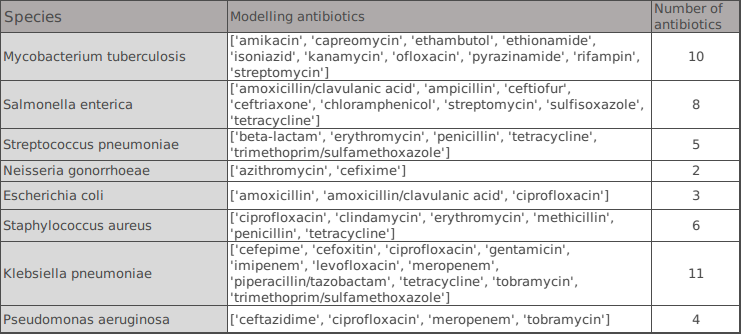
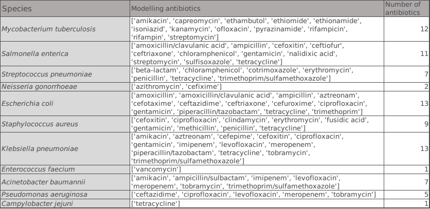

# AMR tools Benchmarking

- [Patric data set](#data)
    - [The procedures for data acquisition](#pro)
    - [Resulting species and antibiotics based on **strict** Quality Control](#strict)
    - [Resulting species and antibiotics based on **loose** Quality Control](#loose)
    - [Get IDs and phenotype for each species and antibiotic combination](#u)
        - [Get the ID list with phenotype directly from txt files](#files)
        - [Load ID list and phenotype through a module](#getdata)
- [Cross-validation folders preparing](#cv)
    - [KMA](#kma)
    - [Phylogenetic tree based split](#tree)
- [ResFinder(4.0)](#p)
- [Multi-species](#m)
   - [Prerequirements](#Prerequirements)
   - [References](#References) 
   - [Single-species model](#single)
   - [Discrete multi-species model](#dis)
   - [Concatenated multi-species model](#con)

- [Seq2Geno2Pheno](#s2g2p)
    - [Installment](#install)
    - [Seq2Geno](#s2g)
    - [Geno2Pheno](#g2p)

- [PhenotypeSeeker](#PhenotypeSeeker)


## <a name="data"></a>Patric data set
### <a name="pro"></a>**1. The procedures for data acquisition:**

- Download all the genomes with AMR phenotype meta-data generated by laboratory methods. This results in 99 species, including 67836 strains/genomes.

- Retain the species that contain larger than 500 strains. This results in 13 species.

**The Sequence ID for each species are in /Patric_data_set/metadata/model/id_$species_name.list, e.g. id_Pseudomonas_aeruginosa.list.**

- Qaulity control over 13 selected species: 

(1). Quality control criteria: strict

    - genome status : not Plasmid
    - genome_quality : Good
    - contigs <= 100
    - fine_consistency>= 97
    - coarse_consistency >= 98
    - checkm_completeness >= 98
    - checkm_contamination <= 2
    - |genome length - mean length| <= mean_length/20


(2). Quality control criteria: loose

    - genome status : not Plasmid
    - genome_quality : Good
    - contigs <=  100 or 75% Quartile (the one is chosen to include more strains, w.r.t. each species)
    - fine_consistency>= 97
    - coarse_consistency >= 98
    - checkm_completeness >= 98 and (missing value also accepted)
    - checkm_contamination <= 2  and  (missing value also accepted)
    - |genome length - mean length| <= mean_length/20
   

Strain number w.r.t. each species before and after Quality control:

 

- Retain strains with phenotype either R(resistant) or S(susceptible), i.e. strains with only I(intermediate)or none phenotype are excluded.

- Delete strains with a conflict phenotype to an antibiotics.

- Retain the species with at least 100 strains w.r.t.  each antibiotic’s each R and S phenotype classrespectively. 


### <a name="strict"></a>2. Resulting species and antibiotics based on **strict** Quality Control:

 


    
### <a name="loose"></a>3. Resulting species and antibiotics based on **loose** Quality Control:




### <a name="u"></a> 4. Getting IDs for each species and antibiotic combination

**<a name="files"></a>(a). Get the ID list directly from txt files.**

(1). Strict Quality Control: 

The Sequence ID for each species and antibiotic combination are in /Patric_data_set/metadata/model/strict/Data_${species_name}${antibiotic_name}.txt, e.g. Data_Escherichia_coli_amoxicillin.txt

With the column named 'resistant_phenotype': 'Resistant': 1, 'Susceptible': 0.

(2). Loose Quality Control:

The Sequence ID for each species and antibiotic combination are in /Patric_data_set/metadata/model/loose/Data_${species_name}${antibiotic_name}.txt, e.g. Data_Escherichia_coli_amoxicillin.txt

With the column named 'resistant_phenotype': 'Resistant': 1, 'Susceptible': 0.

**<a name="getdata"></a>(b). Load ID list and phenotype through a module**

```
cd Patric_data
python
```

```
import amr_utility.load_data
import numpy as np

antibiotics,ID,Y=Patric_data.load_data.extract_info(s,balance,level)

```
**Input**

- s: one of 'Pseudomonas aeruginosa' 'Klebsiella pneumoniae' 'Escherichia coli' 'Staphylococcus aureus' 'Mycobacterium tuberculosis' 'Salmonella enterica' 'Streptococcus pneumoniae'  'Neisseria gonorrhoeae' 
- balance: True; False. If True is set, it provides additional functions of downsampling for unbalanced data set. Reset the majority category's size to 1.5 of the minority category's size, by random selection.

unbalance definition:

balance_ratio=(Number of strains in Susceptible)/(Number of strains in Resistance)

balance_ratio > 2 or balance_ratio < 0.5

- level: 'strict';'loose'.

**Output**

- antibiotics: a list of selected antibiotics w.r.t. specified species.
- ID : matrix of id lists. Each list is the id list for an antibiotic, corresponding to antibiotics list.
- Y: matrix of phenotye lists. 'Resistant': 1, 'Susceptible': 0. Each list is the binary phenotype list for an antibiotic, corresponding to antibiotics list.

Example usage:
Copy the contents of Patric folder to your working directory, then:
```
import amr_utility.load_data
import numpy as np

antibiotics,ID,Y=Patric_data.load_data.extract_info('Pseudomonas aeruginosa',True,'strict')


print('Check: antibiotics ',antibiotics,len(ID),len(Y))
print(len(antibiotics))
for i in np.arange(len(ID)):
    print('Check number of strains for antibiotics ', antibiotics[i], ': ' ,len(ID[i]),' in ID list, ',len(Y[i]), 'in y list')
    
    
# Output a summary of phenotype distribution w.r.t. each antibiotic
antibiotics_selected=load_data.summary('Pseudomonas aeruginosa','loose')

```

## <a name="cv"></a> Cross-validation folders preparing
### 1. <a name="kma"></a>KMA


### 2. <a name="tree"></a>Phylogenetic tree based split
We used the core gene alignment files generated by Roary in the Seq2Geno software (version: precomputed_assemblies,Jul 11, 2021. With modification. ) to contruct a neighbour joining phylogenetic tree for each species, based on whhich we generate a 10-folder phylogeny-aware partitioning for each species using Geno2Pheno (version Nov 2021).

<!--
- Prerequirements: 

Annotate FASTA files with PROKKA

Roary –e –mafft *.gff

```
conda install -c bioconda -c conda-forge prokka
conda config --add channels r
conda config --add channels defaults
conda config --add channels conda-forge
conda config --add channels bioconda
conda install roary
pip3 install biopython
conda install -c conda-forge scikit-learn 
pip install seaborn
conda install pandas
```
- Reference:

https://github.com/microgenomics/tutorials/blob/master/pangenome.md
-->


## <a name="p"></a> ResFinder

Bortolaia, Valeria, et al. "ResFinder 4.0 for predictions of phenotypes from genotypes." Journal of Antimicrobial Chemotherapy 75.12 (2020): 3491-3500.

### 1. Install ResFinder 4.0 from:

https://bitbucket.org/genomicepidemiology/resfinder/src/master/

Database version: 2021.May. 6th
To use the reference database version we used, please unzip the database.zip, otherwise you can follow the instructions of ResFinder 4.0 to download the latest version.

### 2. Preparing.

Copy the contents of /ResFinder to installed ResFinder 4.0 Folder, i.e. /resfinder.

Copy the contents of /Patric_data to installed ResFinder 4.0 Folder, i.e. /resfinder.

### 3. SNP and AMR gene information extraqction.
```
usage: Kaixin_ResFinder_PointFinder.py [-h] [--s S [S ...]] [--n_jobs N_JOBS]
                                       [--check]

optional arguments:
  -h, --help            show this help message and exit
  --s S [S ...], --species S [S ...]
                        species to run: e.g.'seudomonas aeruginosa'
                        'Klebsiella pneumoniae' 'Escherichia coli'
                        'Staphylococcus aureus' 'Mycobacterium tuberculosis'
                        'Salmonella enterica' 'Streptococcus pneumoniae'
                        'Neisseria gonorrhoeae'
  --n_jobs N_JOBS       Number of jobs to run in parallel.
  --check               debug

```
### 4. AMR determination testing score.

```
usage: Kaixin_Predictions_Res_PointFinder_tools.py [-h] --l L --t T
                                                   [--s S [S ...]] [-v]
                                                   [--score SCORE]

optional arguments:
  -h, --help            show this help message and exit
  --l L, --level L      Quality control: strict or loose
  --t T, --tool T       res, point, both
  --s S [S ...], --species S [S ...]
                        species to run: e.g.'seudomonas aeruginosa'
                        'Klebsiella pneumoniae' 'Escherichia coli'
                        'Staphylococcus aureus' 'Mycobacterium tuberculosis'
                        'Salmonella enterica' 'Streptococcus pneumoniae'
                        'Neisseria gonorrhoeae'
  -v, --visualize       visualize the final outcome
  --score SCORE         Score:f1-score, precision, recall, all. All scores are
                        macro.
Namespace(l='loose', s=['Escherichia coli'], score='all', t='both', v=True)

```

### 5. Example.
```
python ./data_preparation/Kaixin_ResFinder_PointFinder.py  --n_jobs=1 --s 'Escherichia coli'

python Kaixin_Predictions_Res_PointFinder_tools.py --s 'Escherichia coli'

```
or 

```
python ./data_preparation/Kaixin_ResFinder_PointFinder_kma.py  --n_jobs=1 -f_all

python Kaixin_Predictions_Res_PointFinder_tools.py -f_all
```


## <a name="m"></a> Multi-species
D Aytan-Aktug, Philip Thomas Lanken Conradsen Clausen, Valeria Bortolaia, Frank Møller Aarestrup, and Ole Lund. Prediction of acquired antimicrobial resistance for multiple bacterial species using neural networks.Msystems, 5(1), 2020.

### <a name="Prerequirements"></a>Prerequirements

Pytorch version: https://pytorch.org/get-started/previous-versions/

```shell
conda create -n multi_bench python=3.6
conda activate multi_bench
pip install sklearn numpy pandas seaborn 
```

### <a name="References"></a>References

https://bitbucket.org/deaytan/data_preparation

https://bitbucket.org/deaytan/neural_networks/src/master/

https://github.com/Bjarten/early-stopping-pytorch/blob/master/pytorchtools.py

### <a name="single"></a>Single-species model

```
python main_feature.py -l "loose" -f_cluster  -s 'Salmonella enterica'
python main_feature.py -l "loose" -f_pre_cluster --n_jobs 9 -s 'Salmonella enterica'
bash ./cv_folders/loose/Salmonella_enterica_kma.sh
python main_feature.py -l "loose" -f_res --n_jobs 14 -s 'Salmonella enterica'
python main_feature.py -l "loose" -f_merge_mution_gene --n_jobs 14 -s 'Salmonella enterica'
python main_feature.py -l "loose" -f_matching_io --n_jobs 14 -s 'Salmonella enterica'
python main_feature.py -f_nn -f_optimize_score 'auc' -learning 0.0 -e 0 -s 'Salmonella enterica'
python main_feature.py -f_nn -f_optimize_score 'f1_macro' -learning 0.0 -e 0 -s 'Salmonella enterica'
python main_feature.py -f_nn -f_fixed_threshold -f_optimize_score 'f1_macro' -learning 0.0 -e 0 -s 'Salmonella enterica'

```


### <a name="dis"></a>Discrete multi-species model

```
python main_discrete_merge.py -f_all  -f_pre_meta
python main_discrete_merge.py -f_all -f_pre_cluster #note: this is merege sequence to one file
for file in cv_folders/loose/multi_species/Mt_Se_Sp_Ec_Sa_Kp_Ab_Pa_Cj/*.sh; do qsub $file; done
python main_discrete_merge.py -f_cluster -f_phylo_roary -f_all #not need redo
python main_discrete_merge.py -f_res -f_merge_mution_gene -f_all
python main_discrete_merge.py -f_matching_io -f_all 

```

```
python  main_discrete_merge.py  -f_nn -f_optimize_score 'f1_macro' -learning 0.0 -e 0 -f_all 
python main_discrete_merge.py  -f_nn -f_optimize_score 'f1_macro' -f_fixed_threshold -learning 0.0 -e 0 -f_all 
python main_discrete_merge.py  -f_nn -f_optimize_score 'auc' -learning 0.0 -e 0 -f_all 

```

### <a name="con"></a>Concatenated multi-species model
1. Merge reference sequences of all the species in db_pointfinder

```
cd ResFinder
python merge_database.py
```

2. Index the newly merged database

Add "merge_species" to the config file under /db_pointfinder, and then index the database with kma_indexing:

```
cd db_pointfinder
python3 INSTALL.py non_interactive
```
3. Run the Resfinder tool with merged database

```
cd ../../
python main_concatenate_merge.py  -n_jobs 20 -f_all -f_run_res
```
4. Neural network validation
```
python main_concatenate_merge.py -f_all  -f_pre_meta
python main_concatenate_merge.py  -f_res  -f_all 
python main_concatenate_merge.py  -f_matching_io  -f_all 
python main_concatenate_merge.py -f_all -f_divers_rank
for file in  cv_folders/loose/multi_concat/Mt_Se_Sp_Ec_Sa_Kp_Ab_Pa_Cj/*.sh; do qsub $file; done
python main_concatenate_merge.py -f_all -f_cluster
```

```
python main_concatenate_merge.py -f_all -f_nn_all_io -f_nn_all -f_optimize_score 'f1_macro' -learning 0.0 -e 0 
python main_concatenate_merge.py -f_all -f_nn_all -f_optimize_score 'f1_macro' -f_fixed_threshold  -learning 0.0 -e 0 
python main_concatenate_merge.py -f_all -f_nn_all -f_optimize_score 'auc' -learning 0.0 -e 0 #on 024, June 13th , qsub. Stoped. June 20th  
python main_concatenate_merge.py -f_all -f_nn_all -f_optimize_score 'f1_macro' -learning 0.0 -e 0 #025 June 12th. Stoped. June 20th 

python main_concatenate_merge.py -f_nn -f_optimize_score 'f1_macro' -f_fixed_threshold  -learning 0.0 -e 0 -f_all
python main_concatenate_merge.py -f_nn -f_optimize_score 'f1_macro' -learning 0.0 -e 0 -f_all 
python main_concatenate_merge.py -f_nn -f_optimize_score 'auc' -learning 0.0 -e 0 -f_all

```

## <a name="s2g2p"></a>Seq2Geno2Pheno

Kuo, T.-H., Weimann, A., Bremges, A., & McHardy, A. C. (2021). Seq2Geno (v1.00001) [A reproducibility-aware, integrated package for microbial sequence analyses].

### <a name="install"></a>Installment of Seq2Geno

1. The original Seq2Geno software, which deals with the original sequence, can be found here: https://github.com/hzi-bifo/seq2geno.git
Install Seq2Geno according to the instruction there. Through this step, an conda envioronment named snakemake_env will be created.

2.In order to use the seq2geno software to process assembled sequences instead of raw sequences, we'll use a branch of it, which deals with assembled data: https://github.com/hzi-bifo/seq2geno/tree/precomputed_assemblies
Update the scripts:
```
git submodule update --init
git fetch --prune
git reset --hard HEAD
git pull origin precomputed_assemblies
```
3. Please then replace the main folder, denovo/denovo.in_one.smk file, all the yml files under denovo folder in seq2geno-precomputed_assemblies this repository.


### <a name="s2g"></a>Seq2Geno


Prepare the files for Seq2Geno:
```
source activate multi_bench
python main_s2p.py -f_prepare_meta -f_all
conda deactivate
````
Run the Seq2Geno tool:

```
source activate snakemake_env
bash log/temp/loose/Pseudomonas_aeruginosa/run.sh 

```
Make a phylo-tree for each species
```
source activate multi_bench_phylo
python main_s2p.py -f_tree -f_all
```
Clear the large tempt folders
```
source activate multi_bench_phylo
python main_s2p.py -f_finished -f_all

```


### <a name="g2p"></a>Geno2Pheno


### <a name="PhenotypeSeeker"></a>PhenotypeSeeker


## Install
```
conda create -n PhenotypeSeeker python=3.7
source activate PhenotypeSeeker
conda install -c bioconda mash
conda install -c bioconda genometester4

```


