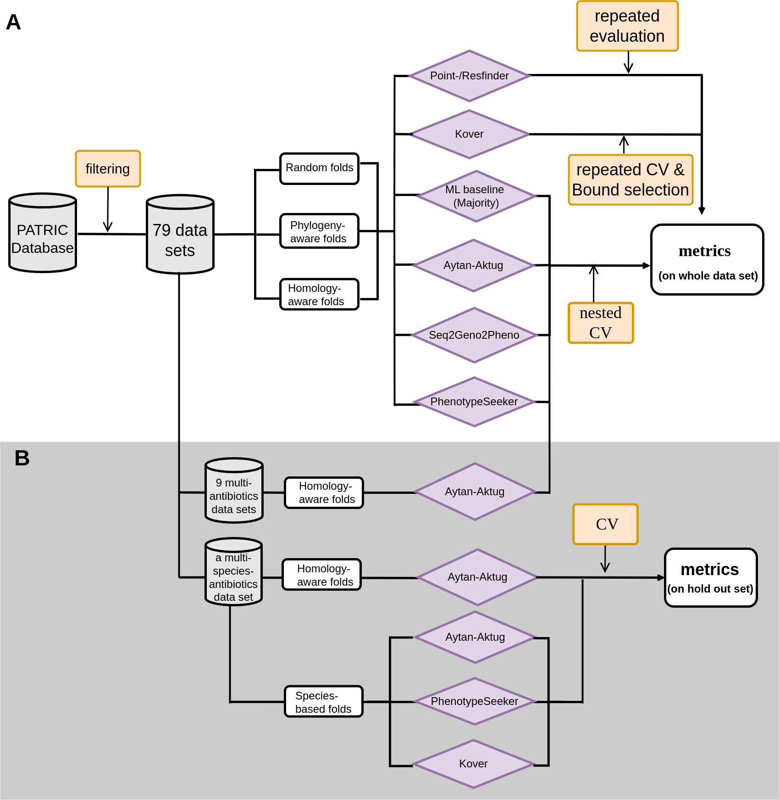

# Assessing computational predictions of antimicrobial resistance phenotypes from microbial genomes



## Contents
- [Introduction](#intro)
    - [software list](#software)
    - [Data sets](#data)
- [Prerequirements](#pre)
- [Input](#input)
- [Output](#output)
- [Usage](#usage)  
- [References](#ref)   
- [License](#license)
- [Citation](#citation)
- [Contact](#contact)


## <a name="intro"></a>Introduction
### software list

- We compare the binary phenotype prediction performance of four machine learning (ML)- based and one direct association antimicrobial resistance (AMR) determination software:
1. [Aytan-Aktug](https://bitbucket.org/deaytan/neural_networks/src/master/) [[1]](#1), 
2. Seq2Geno2Pheno ([Seq2Geno](https://github.com/hzi-bifo/seq2geno.git)&[Geno2Pheno](https://github.com/hzi-bifo/GenoPheno)) [[2]](#2), 
3. [PhenotypeSeeker v 0.7.3](https://github.com/bioinfo-ut/PhenotypeSeeker) [[3]](#3), 
4. [Kover 2.0](https://github.com/aldro61/kover) [[4]](#4),
5. [ResFinder 4.0](https://bitbucket.org/genomicepidemiology/resfinder/src/master/) [[5]](#5), a direct association software based on AMR determinant database, was used as the baseline.

- All software methods, except for Kover, were benchmarked with adaptation versions (provided in `./AMR_software`).

### <a name="data"></a>Data sets

- <a href="https://github.com/hzi-bifo/AMR_benchmarking/wiki/Species-and-antibiotics">Data sets overview</a>
- Sample list of each data set in the form of `Data_<species>_<antibiotic>` and sample phenotype metadata of each data set `Data_<species>_<antibiotic>_pheno.txt` under the folder <a href="https://github.com/hzi-bifo/AMR_benchmarking/tree/main/data/PATRIC/meta/loose_by_species">data/PATRIC/meta/loose_by_species</a>
- <a href="https://github.com/hzi-bifo/AMR_benchmarking/tree/main/data/PATRIC/cv_folds/loose">Cross-validation folds</a> were generated through Aytan-Aktug (homology-aware folds), Seq2Geno2Pheno(phylogeny-aware and random folds, except for  *M. tuberculosis*), and scikit-learn package model_selection.KFold
(random folds for  *M. tuberculosis* folds).


## <a name="pre"></a>Prerequirements
- Dependencies
    - To reproduce the output, you need to use Linux OS and `conda`. Miniconda2 4.8.4 was used by us. All software environments were activated under "base"       env, which is the default environment.

    - Installation of the conda environments:
        ```
        bash ./install/install.sh #Create 9 pieces of conda environments and install packages respectively
        ```
    -  If coming across creating environment for Kover, please refer to [Kover](https://aldro61.github.io/kover/doc_installation.html) to try other installation methods.
    - Finally, you need to install pytorch in the `multi_torch_env` manually. To install pytorch compatible with your CUDA version, please fellow this instruction: https://pytorch.org/get-started/locally/. Our code was tested with pytorch v1.7.1, with CUDA Version 10.1 and 11.0 .


- Memory requirement: Some procedures require extremely large memory. Aytan-Aktug multi-species model (adaptation version) feature building needs ~370G memory. Other ML software needs up to 80G memory, depending on the number of CPU and which species-antibiotic combination.

- Disk storage requirement: Some procedures generate extremely large intermediate files, although they are deleted once the procedures generate feature files. E.g. PhenotypeSeeker (adaptation version) needs up to the magnitude of 10T depending on the data set size of the species running, which will be deleted automatically. 


## <a name="input"></a>Input file
The input file is a yaml file `Config.yaml` at the root folder where all options are described:

**A. Basic/required parameters setting**

- Please change everything in A after the ":" to your own.

| option | action | values ([default])|
| ------------- | ------------- |------------- |
|dataset_location| To where the PATRIC dataset will be downloaded. ~246G| /vol/projects/BIFO/patric_genome|
|output_path| To where to generate the `Results` folder for the direct results of each software and further visualization. | ./|
|log_path| To where to generate the `log` folder for the intermediate files (~10 TB, while regularly cleaning files related to completed benchmarking species). | ./|
|n_jobs| CPU cores (>1) to use. | 10 |
|gpu_on| GPU possibility for Aytan-Aktug SSSA model, If set to False, parallelization on CPU will be applied; Otherwise, it will be applied on one gpu core sequentially.  | False |
|clean_software|Clean large intermediate files of the specified software (optional). Large temp files can also be manually removed from `<log_path>/log/software/<software_name>/software_output`.||

**B.Optional parameters setting**

- Please change the conda environment names if the same names already exist in your working PC.

|option|	action	|values ([default])|
| ------------- | ------------- |------------- |
|amr_env_name,amr_env_name2|conda env for general use |amr_env,amr2|
|PhenotypeSeeker_env_name|conda env for PhenotypeSeeker |PhenotypeSeeker_env|
|multi_env_name|conda env for |multi_env|
|multi_torch_env_name|conda env for NN model|multi_torch_env|
|kover_env_name|conda env for Kover|kover_env|
|se2ge_env_name|conda env for Seg2Geno|snakemake_env|
|kmer_env_name|conda env for Seg2Geno k-mers generation |kmer_kmc|
|phylo_name|conda env for Seg2Geno phylogenetic trees generation|phylo_env|
|phylo_name2|conda env for visualization of misclassified genomes|phylo_env2|
|resfinder_env|conda env for ResFinder|res_env|


**C. Advanced/optional parameters setting (Model)** 

- You can evaluate for a subset of species at a time  by modifying the values of the 'species_list' and 'species_list_phylotree' options.
- For species related to  [multi-models](https://github.com/hzi-bifo/AMR_benchmarking/wiki/Advanced-parameters-setting-for-multi%E2%80%90Models) , we have listed the possible maximum (in terms of data sets this study provides) for each setting, so you can explore as you like by making new combinations of the listed species. Users, who would like to reproduce this AMR benchmarking results, are not advised to change settings in this category. 
 
|option|	action	|values ([default])|
| ------------- | ------------- |------------- |
|species_list|Benchmarked species under random and homology-aware folds for single-species evaluation |Escherichia_coli, Staphylococcus_aureus, Salmonella_enterica, Klebsiella_pneumoniae, Pseudomonas_aeruginosa, Acinetobacter_baumannii, Streptococcus_pneumoniae, Mycobacterium_tuberculosis, Campylobacter_jejuni, Enterococcus_faecium, Neisseria_gonorrhoeae|
|species_list_phylotree|Benchmarked species under phylogeny-aware folds for single-species evaluation |Escherichia_coli, Staphylococcus_aureus, Salmonella_enterica, Klebsiella_pneumoniae, Pseudomonas_aeruginosa, Acinetobacter_baumannii, Streptococcus_pneumoniae, Campylobacter_jejuni, Enterococcus_faecium, Neisseria_gonorrhoeae|
|cv_number|The k value of k-fold nested cross-validation |10|


## <a name="output"></a>Output
```
└── Results
    ├── final_figures_tables
    ├── other_figures_tables
    ├── supplement_figures_tables    
    └── software
        ├── AytanAktug
        ├── kover
        ├── majority
        ├── phenotypeseeker
        ├── resfinder_b
        ├── resfinder_folds
        ├── resfinder_k
        └── seq2geno

```

-  Cross-validation results of each ML software and evaluation results of Resfinder are generated under `output_path/Results/<name of the software>`.
- Visualization tables and graphs are generated under `output_path/Results/final_figures_tables` and `output_path/Results/supplement_figures_tables`.
- Numbers and statistic results mentioned in our benchmarking article are generated under `output_path/Results/other_figures_tables`.
<!--
- Stochastic factors in generating results:( **do we actually needed to say this? or not**)  We provide in this repository the software or corresponding adaptation versions of all the methods we benchmarked, with the original software accessed time and modification details disclosed in our publication. We set a predefined seed for processes including predictor learning and folds partition. But there are 2 points that invite stochastic factors. [KMA](https://bitbucket.org/genomicepidemiology/kma/src/master/) version, which is installed from the repository when setting up ResFinder (as by instructions of ResFinder on 2021-05-06), and Neural networks dropout mechanism. We accessed KMA on 2021-05-06 for all except for P. aeruginosa samples for three multi-species models, we accessed the KMA on September 2022. As we assume the KMA version influence small, we provide in `./AMR_software/resfinder/cge` a KMA retrieved on 2022-11-05. 
-->

## <a name="usage"></a>Usage
```
git clone https://github.com/hzi-bifo/AMR_benchmarking.git
bash main.sh #details of usage were explained in main.sh. You can't finish the whole AMR benchmarking just by setting this command to run once.
bash ./scripts/model/clean.sh # Optional. Clean intermediate files 
```

- One could see `main.sh` for benchmarking workflow. 
<!--
, which goes through the whole benchmarking process including conda environment installation, data downloading/reprocessing, evaluating Resfinder, evaluating Aytan-Aktug, evaluating Seq2Geno2Pheno, evaluating Phenotyperseeker, evaluating Kover, evaluating ML baseline (majority), and benchmarking results visualization
- We suggest you run `main.sh` step by step by commenting some codes there at one time and run one species by one species at a time by setting species_list and species_list_phylotree options in the `Config.yaml` (of course except for multi-models). `./scripts/model/<software_name>.sh` also provides more detailed instructions for running this benchmarking workflow. You can't finish the whole AMR benchmarking just by submitting `main.sh` to run once and for all due to several reasons. Due to large data sets and time-consuming ML model learning process, which altogether may take more than 2 months with 20 CPUs accompanied by 10 GPUs, you may need to run different tasks on different machines and re-run some processes if it accidentally terminates unexpectedly during a long period.
-->

- Clean large and less important intermediate files. You can run it any time after the specified software finishes running on a benchmarked species. Don't use it when the corresponding software is running on a new benchmarked species. 


## <a name="ref"></a>References
<a id="1">[1]</a>  D Aytan-Aktug, Philip Thomas Lanken Conradsen Clausen, Valeria Bortolaia, Frank Møller Aarestrup, and Ole Lund. Prediction of acquired antimicrobial resistance for multiple bacterial species using neural networks.Msystems, 5(1), 2020.

<a id="2">[2]</a>   Ariane Khaledi, Aaron Weimann, Monika Schniederjans, Ehsaneddin Asgari, Tzu-Hao Kuo, Antonio Oliver, Gabriel Cabot, Axel Kola, Petra Gastmeier, Michael Hogardt, et al. Predicting antimicrobial resistance in pseudomonas aeruginosa with machine learning-enabled molecular diagnostics. EMBO molecular medicine, 12(3):e10264, 2020.

<a id="3">[3]</a>  Erki Aun, Age Brauer, Veljo Kisand, Tanel Tenson, and Maido Remm. A k-mer-based method for the identification of phenotype-associated genomic biomarkers and predicting phenotypes of sequenced bacteria. PLoS computational biology, 14(10):e1006434, 2018.

<a id="4">[4]</a> Alexandre Drouin, Gaël Letarte, Frédéric Raymond, Mario Marchand, Jacques Corbeil, and François Laviolette. Interpretable genotype-to-phenotype classifiers with performance guarantees. Scientific reports, 9(1):1–13, 2019.

<a id="5">[5]</a>  Valeria Bortolaia, Rolf S Kaas, Etienne Ruppe, Marilyn C Roberts, Stefan Schwarz, Vincent Cattoir, Alain Philippon, Rosa L Allesoe, Ana Rita Rebelo, Alfred Ferrer Florensa, et al. Resfinder 4.0 for predictions of phenotypes from genotypes. Journal of Antimicrobial Chemotherapy, 75(12): 3491–3500, 2020.


## <a name="license"></a> License
MIT License
## <a name="citation"></a> Citation


## <a name="contact"></a> Contact
- Open an  [issue](https://github.com/hzi-bifo/AMR_benchmarking/issues) in the repository.
- Send an email to Kaixin Hu (Kaixin.Hu@helmhotz-hzi.de).


