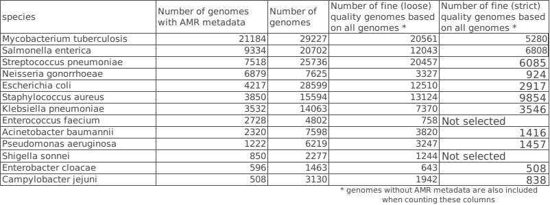

# AMR tools Benchmarking

- [Patric data set](#data)
    - [The procedures for data acquisition](#pro)
    - [Resulting species and antibiotics based on **strict** Quality Control](#strict)
    - [Resulting species and antibiotics based on **loose** Quality Control](#loose)
- [ResFinder](#p)
- [Multi-species](#m)

### 1. Patric data set
- **The procedures for data acquisition:**

1. Download all the genomes with AMR phenotype meta-data generated by laboratory methods. This results in 99 species, including 67836 strains/genomes.

2. Retain the species that contain larger than 500 strains. This results in 13 species.

**The Sequence ID for each species are in /Patric_data_set/metadata/model/id_$species_name.list, e.g. id_Pseudomonas_aeruginosa.list.**

3. Qaulity control over 13 selected species: 

(1). Quality control criteria: strict

    - genome status : not Plasmid
    - genome_quality : Good
    - contigs <= 100
    - fine_consistency>= 97
    - coarse_consistency >= 98
    - checkm_completeness >= 98
    - checkm_contamination <= 2
    - |genome length - mean length| <= mean_length/20

(2). Quality control criteria: loose

    - genome status : not Plasmid
    - genome_quality : Good
    - contigs <=  100 or 75% Quartile (the one is chosen to include more strains, w.r.t. each species)
    - fine_consistency>= 97
    - coarse_consistency >= 98
    - checkm_completeness >= 98 and (missing value also accepted)
    - checkm_contamination <= 2  and  (missing value also accepted)
    - |genome length - mean length| <= mean_length/20
    - Retain the species with at least 100 strains w.r.t.  each antibiotic’s each R and S phenotype classrespectively.

Strain number w.r.t. each species before and after Quality control:

 

4. Retain strains with phenotype either R(resistant) or S(susceptible), i.e. strains with only I(intermediate)or none phenotype are excluded.

5. Retain the species with at least 100 strains w.r.t.  each antibiotic’s each R and S phenotype classrespectively. 

- Resulting species and antibiotics based on **strict** Quality Control:

 

    
- Resulting species and antibiotics based on **loose** Quality Control:

### 2. ResFinder

Bortolaia, Valeria, et al. "ResFinder 4.0 for predictions of phenotypes from genotypes." Journal of Antimicrobial Chemotherapy 75.12 (2020): 3491-3500.

https://bitbucket.org/genomicepidemiology/resfinder/src/master/

### 3. Multi-species
Nguyen, Marcus, et al. "Predicting antimicrobial resistance using conserved genes." PLoS computational biology 16.10 (2020): e1008319.

https://bitbucket.org/deaytan/data_preparation
https://bitbucket.org/deaytan/neural_networks/src/master/

